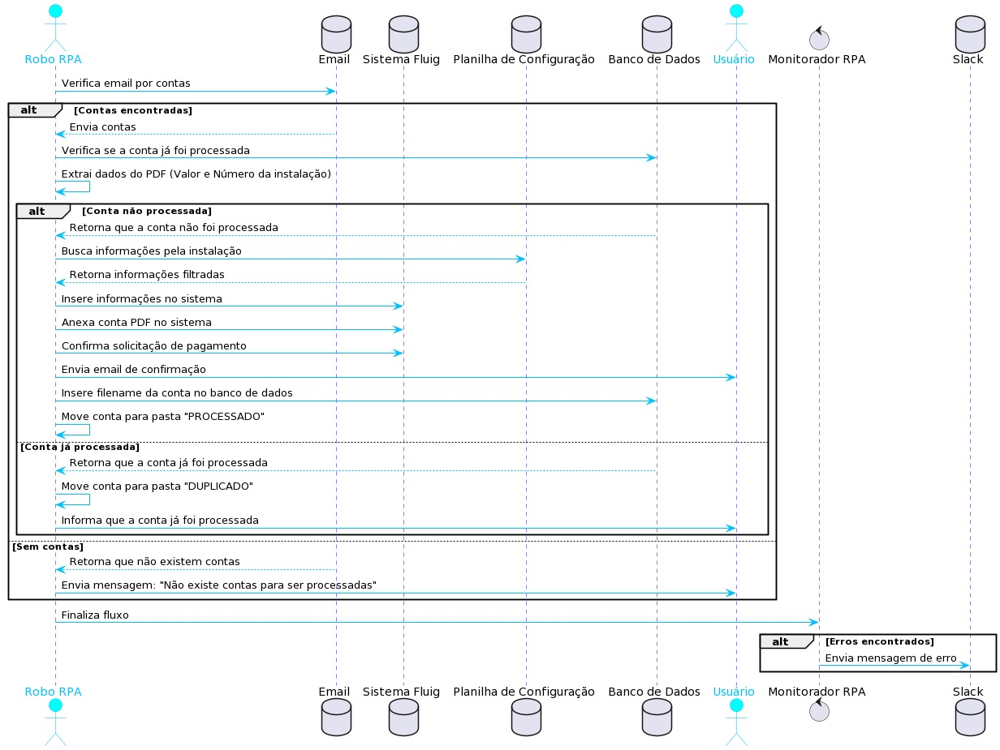

# Documentação do Robô de Solicitação de Pagamento :dollar: :robot_face:

## Objetivo

RPA responsável por realizar a solicitação de Pagamento de Água e Luz no sistema Fluig.

## Contas Suportadas

* Cesan
* EDP 
* Santa Maria
* SAAE
* BRK

## Diagrama de Sequencia

## Layout do Projeto

    convert_pdf_to_txt/

        pdf_txt.py # Módulo responsável por realizar a conversão de txt para PDF.
    
    database/
        
        db.py  # Módulo responsável por realizar conexão com o bd sqlite, e contém as funções necessárias para o projeto.

    dealerships_xlsx/ # Planilha de configuração para o projeto. 
    doc_payment_request/ # Configurações da documentação do projeto 
    download_pdf_from_email/
        
        extract_pdf_email.py # ! deprecated ! | Baixa contas do E-mail do Outlook Desktop 
        new_extract_pdf_email_msal.py # Módulo responsável por realizar o donwlodad das contas do Email Outlook Web, via API.
        generate_token_acess.py # Módulo responsável por gerar um Token de acesso a API.
    
    helpers/ # Classe utilitária do RPA, responsável por realizar a instância do Selenium, e também setar as configurações do navegador 
    log_data/ # Classe de Log 
    send_email_tracert/ 

        send_tracert.py # Módulo responsável por realizar o envio de Emails.
    
    slack_monitoring/ 

    slack_notifier.py # Móduylo responsável por realizar a conexão com a API do Slack e realizar o envio das mensagens para os canais.

    main.py # Módulo principal que chama todas as funções.
    requirements.lock # Todas as dependências do projeto gerada pelo pip freeze
    requirements.txt # Libs que foram instaladas no projeto
    rpa_fluig.py # Módulo responsável por realizar o RPA 
    sample.env # env de exemplo de como deve ser configurada a .env
